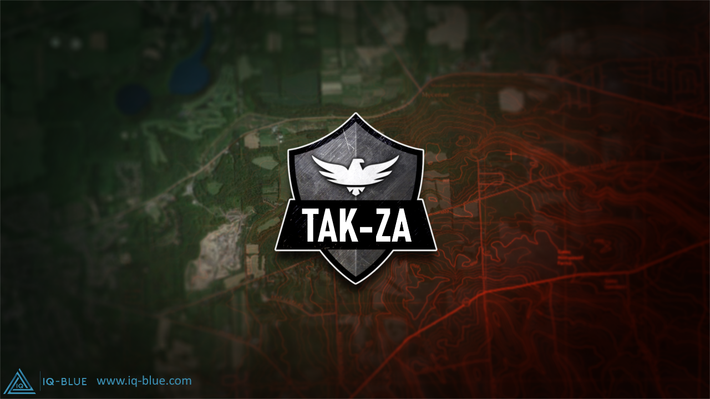

# TAK-ZA

Documents relating to the TAK ecosystem

Best places to host your server in South Africa?

- try
  - [afrihost](https://www.afrihost.com/shared-hosting)
  - [xneelo](https://xneelo.co.za/web-hosting)

 Or setup your own FreeTAKserver or original TAKServer.

 If you need local help or a managed server locally send us a message on Github or email [support@iq-blue.com](support@iq-blue.com) or [support@tak-za.co.za](support@tak-za.co.za).

 If you need custom software or plugins contact us.

Check out our TAK-ZA dedicated site [https://tak-za.co.za](https://tak-za.co.za)

 
